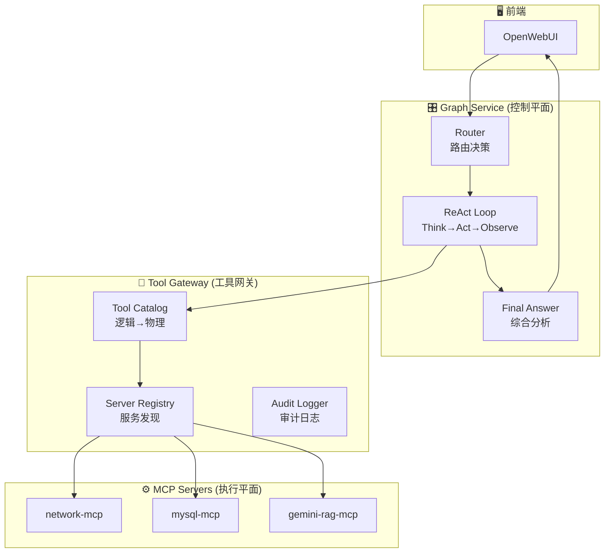

# AI Agent 平台可复用组件指南

本文档梳理了 AIAgentPlatform 项目中可复用的组件，帮助快速构建新的 Agent 和 MCP Server。

## 项目架构概览



## 一、可复用组件清单

### 1. MCP 基础设施 (完全复用)

| 组件 | 位置 | 用途 |
|------|------|------|
| `McpClientManager` | `mcp_manager/client_manager.py` | MCP Server 生命周期管理 |
| `McpStdioConnection` | `mcp_manager/stdio_connection.py` | stdio 传输层连接 |
| `LangChainAdapter` | `mcp_manager/adapters/langchain_adapter.py` | MCP 工具转 LangChain Tool |

### 2. 配置管理 (完全复用)

| 组件 | 位置 | 用途 |
|------|------|------|
| `ConfigManager` | `utils/config_manager.py` | 配置热加载、LLM 实例管理 |
| `config_watcher` | `utils/config_watcher.py` | 配置文件变化监听 |
| `config_loader` | `utils/config_loader.py` | YAML 配置加载、环境变量替换 |

### 3. LangGraph 工作流 (部分复用)

| 组件 | 位置 | 用途 |
|------|------|------|
| `GraphState` | `graph_service/state.py` | 状态定义模板 |
| `react_think_node` | `graph_service/nodes/react_think.py` | ReAct Think 节点 |
| `react_act_node` | `graph_service/nodes/react_act.py` | ReAct Act 节点 |
| `react_observe_node` | `graph_service/nodes/react_observe.py` | ReAct Observe 节点 |
| `router_node` | `graph_service/nodes/router.py` | 智能路由节点 |

### 4. 工具网关 (完全复用)

| 组件 | 位置 | 用途 |
|------|------|------|
| `ToolGateway` | `tool_gateway/gateway.py` | 统一工具调用入口 |
| `ToolCatalog` | `tool_gateway/catalog.py` | 逻辑工具名→物理端点映射 |
| `ServerRegistry` | `tool_gateway/registry.py` | MCP Server 注册与健康检查 |
| `AuditLogger` | `tool_gateway/audit.py` | 工具调用审计 |

### 5. OpenAI 兼容 API (完全复用)

| 组件 | 位置 | 用途 |
|------|------|------|
| `openai_api.py` | `graph_service/openai_api.py` | OpenAI 格式 API，对接 OpenWebUI |

### 6. 辅助工具 (完全复用)

| 组件 | 位置 | 用途 |
|------|------|------|
| `TokenTracker` | `utils/token_tracker.py` | Token 使用统计 |
| `QueryCache` | `utils/query_cache.py` | 查询结果缓存 |
| `logger` | `utils/logger.py` | 日志配置 |

---

## 二、添加新 Agent 的步骤

### 步骤 1: 配置 Agent 映射

编辑 `config/agent_mapping.yaml`：

```yaml
agents:
  # 新增 Agent
  your_agent:
    config_key: "your_agent_config"    # agent_config.yaml 中的键
    full_name: "your_agent"            # 路由使用的完整名称
    short_names:
      - "your"
      - "你的"
    description: "你的 Agent 描述"
    tools_prefix: "your_tools"         # tools_config.yaml 中的工具前缀
```

### 步骤 2: 配置 Agent 行为

编辑 `config/agent_config.yaml`：

```yaml
agents:
  your_agent_config:
    name: "YourAgent"
    description: "你的 Agent 描述"
    tools_prefix: "your_tools"
    system_prompt: |
      你是一个专业的助手...
      
      ## 核心原则
      1. 禁止返回"无法处理"
      2. ...
      
      ## 工作流程
      1. 分析用户问题
      2. 选择合适的工具
      3. 执行并返回结果
```

### 步骤 3: 配置路由规则

编辑 `config/langgraph_config.yaml`：

```yaml
langgraph:
  router:
    keyword_rules:
      - keywords: ["你的", "关键词", "列表"]
        target_node: "your_agent"
```

**无需修改代码！** Router 会自动加载配置并路由到新 Agent。

---

## 三、添加新 MCP Server 的步骤

### 步骤 1: 创建 MCP Server 模块

在 `mcp_servers/` 下创建目录：

```
mcp_servers/
└── your_mcp/
    ├── __init__.py
    └── server.py
```

### 步骤 2: 实现 MCP Server

`server.py` 模板：

```python
"""
Your MCP Server
提供你的工具集
"""
import asyncio
from typing import Any, Dict, List
from mcp.server import Server
from mcp.types import Tool, TextContent
from loguru import logger
import json

# 创建 MCP Server 实例
app = Server("your-mcp")


@app.list_tools()
async def list_tools() -> List[Tool]:
    """列出所有可用工具"""
    return [
        Tool(
            name="your_tools.tool_name",  # 使用 prefix.name 格式
            description="工具描述",
            inputSchema={
                "type": "object",
                "properties": {
                    "param1": {"type": "string", "description": "参数1描述"},
                    "param2": {"type": "integer", "description": "参数2描述"}
                },
                "required": ["param1"]
            }
        )
    ]


@app.call_tool()
async def call_tool(name: str, arguments: Dict[str, Any]) -> List[TextContent]:
    """调用指定的工具"""
    logger.info(f"调用工具: {name}, 参数: {arguments}")

    if name == "your_tools.tool_name":
        # 实现你的工具逻辑
        result = {"success": True, "data": "..."}
        return [TextContent(type="text", text=json.dumps(result, ensure_ascii=False))]

    return [TextContent(type="text", text=json.dumps({"error": f"未知工具: {name}"}))]


async def main():
    """启动 MCP Server"""
    from mcp.server.stdio import stdio_server

    async with stdio_server() as (read_stream, write_stream):
        await app.run(read_stream, write_stream, app.create_initialization_options())


if __name__ == "__main__":
    asyncio.run(main())
```

### 步骤 3: 注册 MCP Server

编辑 `config/mcp_config.yaml`：

```yaml
mcp_servers:
  - name: your-mcp
    command: python
    args:
      - "-m"
      - "mcp_servers.your_mcp.server"
    tools_prefix: "your_tools"
    description: "你的工具集描述"
    env:
      YOUR_API_KEY: "${YOUR_API_KEY}"
```

### 步骤 4: 配置工具参数（可选）

如果需要详细的工具参数配置，编辑 `config/tools_config.yaml`：

```yaml
tools:
  your_tools:
    tool_name:
      name: "your_tools.tool_name"
      description: "工具描述"
      parameters:
        param1:
          type: "string"
          description: "参数1描述"
          required: true
        param2:
          type: "integer"
          description: "参数2描述"
          default: 10
      timeout: 30
```

---

## 四、配置文件速查

| 配置文件 | 用途 | 何时修改 |
|----------|------|----------|
| `agent_mapping.yaml` | Agent 名称映射 | 添加新 Agent |
| `agent_config.yaml` | Agent 行为配置（system_prompt） | 修改 Agent 行为 |
| `mcp_config.yaml` | MCP Server 注册 | 添加新 MCP Server |
| `tools_config.yaml` | 工具参数定义 | 定义工具参数 schema |
| `llm_config.yaml` | LLM 配置 | 修改模型/provider |
| `langgraph_config.yaml` | 路由规则 | 添加关键词路由 |
| `logging_config.yaml` | 日志配置 | 调整日志级别 |

---

## 五、关键代码复用模式

### 1. 从配置文件获取 LLM

```python
from utils import get_config_manager

config_manager = get_config_manager()
llm = config_manager.get_llm("your_instance_name")
```

### 2. 加载配置文件

```python
from utils import (
    load_llm_config,
    load_agent_config,
    load_mcp_config,
    load_tools_config,
    load_agent_mapping_config
)

llm_config = load_llm_config()
agent_config = load_agent_config()
```

### 3. 调用 MCP 工具

```python
from mcp_manager import McpClientManager

manager = McpClientManager()
await manager.start_all_servers()
result = await manager.call_tool("your_tools.tool_name", {"param1": "value"})
```

### 4. Token 统计

```python
from utils.llm_wrapper import invoke_llm_with_tracking

response = invoke_llm_with_tracking(llm, prompt, "component_name")
```

---

## 六、扩展场景示例

### 场景 A: 添加 Kubernetes Agent

1. **agent_mapping.yaml**: 添加 `k8s` Agent 映射
2. **agent_config.yaml**: 添加 `k8s` 的 system_prompt
3. **mcp_config.yaml**: 注册 `k8s-mcp` Server
4. **创建** `mcp_servers/k8s_mcp/server.py`: 实现 kubectl 封装
5. **langgraph_config.yaml**: 添加关键词 `["k8s", "pod", "deployment", "kubernetes"]`

### 场景 B: 添加日志分析 Agent

1. **agent_mapping.yaml**: 添加 `log_analyzer` Agent 映射
2. **agent_config.yaml**: 添加分析日志的 system_prompt
3. **mcp_config.yaml**: 注册 `log-mcp` Server
4. **创建** `mcp_servers/log_mcp/server.py`: 实现日志搜索/分析
5. **langgraph_config.yaml**: 添加关键词 `["日志", "log", "错误", "异常"]`

### 场景 C: 添加监控告警 Agent

1. 复用现有 MCP 基础设施
2. 创建 `prometheus-mcp` 或 `grafana-mcp`
3. 配置 Agent 映射和路由
4. 无需修改 Graph Service 代码

---

## 七、不可复用（需定制）的部分

| 组件 | 位置 | 需要定制的原因 |
|------|------|----------------|
| `system_prompt` | `agent_config.yaml` | 每个 Agent 的行为逻辑不同 |
| `MCP Server 实现` | `mcp_servers/*/server.py` | 工具逻辑因场景而异 |
| `工具参数定义` | `tools_config.yaml` | 每个工具的参数不同 |

---

## 八、快速开始 Checklist

添加新功能时，按以下顺序操作：

- [ ] 1. 确定 Agent 名称和工具前缀
- [ ] 2. 在 `agent_mapping.yaml` 添加映射
- [ ] 3. 在 `agent_config.yaml` 添加 system_prompt
- [ ] 4. 创建 MCP Server（`mcp_servers/xxx_mcp/server.py`）
- [ ] 5. 在 `mcp_config.yaml` 注册 Server
- [ ] 6. （可选）在 `tools_config.yaml` 定义工具参数
- [ ] 7. 在 `langgraph_config.yaml` 添加路由关键词
- [ ] 8. 重启服务：`bash scripts/restart_all.sh`
- [ ] 9. 测试

---

## 九、架构优势

1. **零代码添加 Agent**：通过配置文件即可添加新 Agent
2. **统一的工具调用**：所有工具通过 MCP 协议标准化
3. **热加载配置**：修改配置无需重启（大部分场景）
4. **LLM 无关**：支持 DeepSeek、Gemini、OpenAI、Ollama 等
5. **可观测性**：内置 Token 统计、审计日志、执行历史
