# 智能网络诊断基线分析方案

## 文档信息

| 项目 | 内容 |
|------|------|
| 文档版本 | v1.2 |
| 创建日期 | 2025-12-30 |
| 项目名称 | NSSA AI Agent Platform - 智能基线分析模块 |
| 文档状态 | 方案设计 |

---

## 1. 业务需求

### 1.1 方案定位

本方案是对现有网络管理工具（NMS）的功能补充，而非替代。

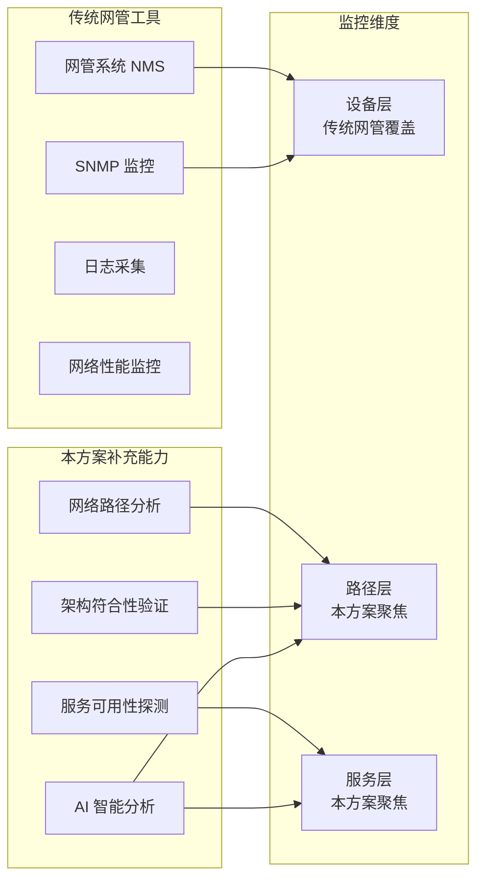

**与传统网管的差异化定位**：

| 维度 | 传统网管工具 | 本方案 |
|------|-------------|--------|
| 监控对象 | 网络设备（交换机、路由器、防火墙） | 网络路径、服务端点 |
| 监控方式 | SNMP、Syslog、NetFlow | 主动探测（DNS/TCP/TLS/HTTP/MTR） |
| 监控视角 | 设备健康状态、端口流量 | 端到端用户体验、路径质量 |
| 分析能力 | 阈值告警、简单统计 | AI 智能分析、趋势预测 |
| 适用场景 | 设备故障、端口异常 | 路径变化、服务降级、架构偏离 |

### 1.2 背景与痛点

在传统网管工具已覆盖设备层监控的基础上，企业仍面临以下挑战：

| 痛点 | 描述 | 影响 |
|------|------|------|
| 路径盲区 | 无法感知网络路径变化和质量 | 路由抖动、链路切换难以发现 |
| 架构偏离 | 无法验证实际流量是否符合设计 | 安全策略失效、性能瓶颈 |
| 服务黑盒 | 只知设备正常，不知服务是否可达 | 用户投诉才发现问题 |
| 被动响应 | 依赖用户报障才发现问题 | 故障发现滞后，影响业务 |
| 缺乏基线 | 无法判断当前状态是否正常 | 误报多，漏报多 |
| 人工分析 | 依赖专家经验进行故障定位 | 效率低，知识难传承 |

### 1.3 业务目标

| 目标 | 描述 | 量化指标 |
|------|------|----------|
| 主动发现 | 在用户感知前发现异常 | 故障发现时间 < 5 分钟 |
| 智能分析 | AI 自动进行根因分析 | 根因定位准确率 > 80% |
| 知识沉淀 | 积累运维知识库 | 知识库覆盖率 > 90% |
| 降低噪音 | 减少无效告警 | 告警准确率 > 95% |
| 趋势预测 | 预测潜在风险 | 提前 24 小时预警 |

### 1.4 用户角色

| 角色 | 职责 | 核心诉求 |
|------|------|----------|
| 网络运维工程师 | 日常网络监控和故障处理 | 快速定位问题，减少排查时间 |
| SRE 工程师 | 保障服务可用性 | 主动发现风险，预防故障 |
| 运维经理 | 团队管理和决策 | 了解整体健康状况，优化资源 |
| 开发工程师 | 应用开发和调试 | 快速判断是否为网络问题 |

---

## 2. 产品功能

### 2.1 核心能力概述

本方案聚焦三大核心能力，补充传统网管工具的监控盲区：

```mermaid
flowchart TB
    subgraph "核心能力 1: 网络路径分析"
        MTR["MTR 路径探测"]
        PathChange["路径变化检测"]
        HopAnalysis["跳数分析"]
        LatencyMap["延迟分布图"]
        LossDetect["丢包定位"]
    end

    subgraph "核心能力 2: 架构符合性验证"
        TopoVerify["拓扑验证"]
        PolicyCheck["策略检查"]
        CDNVerify["CDN 验证"]
        DNSVerify["DNS 解析验证"]
        TLSVerify["TLS 配置验证"]
    end

    subgraph "核心能力 3: 服务可用性探测"
        TCPProbe["TCP 连通性"]
        HTTPProbe["HTTP 可用性"]
        TLSProbe["TLS 握手"]
        E2EProbe["端到端探测"]
        MultiPoint["多点探测"]
    end

    MTR --> PathChange
    PathChange --> HopAnalysis
    HopAnalysis --> LatencyMap
    LatencyMap --> LossDetect

    TopoVerify --> PolicyCheck
    PolicyCheck --> CDNVerify
    CDNVerify --> DNSVerify
    DNSVerify --> TLSVerify

    TCPProbe --> HTTPProbe
    HTTPProbe --> TLSProbe
    TLSProbe --> E2EProbe
    E2EProbe --> MultiPoint
```

### 2.2 网络路径分析

网络路径分析是本方案的核心差异化能力，通过 MTR（My Traceroute）技术实现对网络路径的深度洞察。

**功能说明**：

| 功能点 | 描述 | 价值 |
|--------|------|------|
| 路径发现 | 探测从源到目标的完整网络路径 | 了解实际流量走向 |
| 跳数监控 | 监控路径跳数变化 | 发现路由变更 |
| 逐跳延迟 | 测量每一跳的延迟 | 定位延迟瓶颈 |
| 逐跳丢包 | 统计每一跳的丢包率 | 定位丢包节点 |
| 路径基线 | 建立正常路径基线 | 检测路径异常 |
| 趋势分析 | 分析路径质量趋势 | 预测潜在问题 |

**典型场景**：

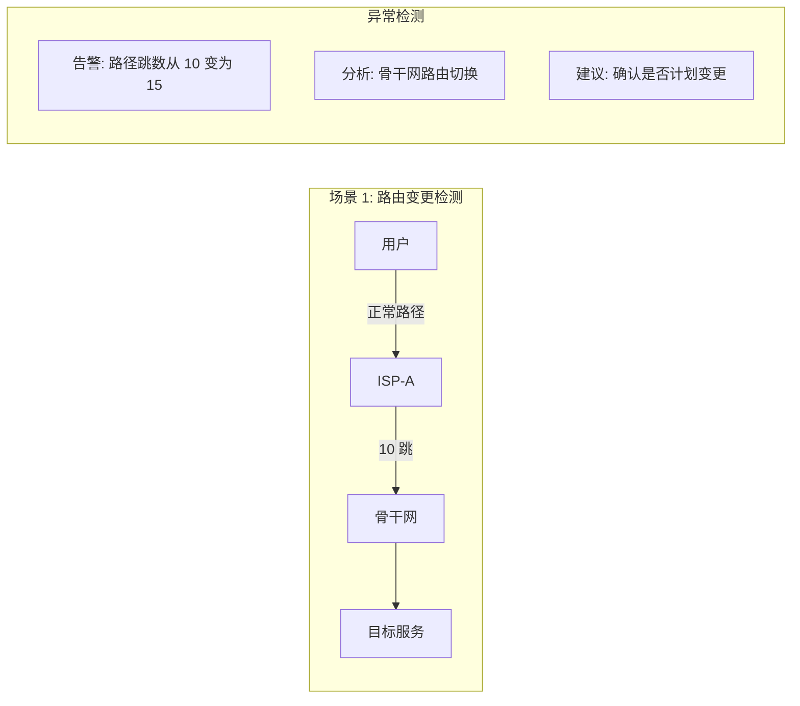

**监控指标**：

| 指标 | 正常范围 | 异常阈值 | 告警级别 |
|------|----------|----------|----------|
| 路径跳数 | 基线 ± 2 | 变化 > 3 跳 | 一般 |
| 平均延迟 | 基线 ± 2σ | > 基线 + 3σ | 重要 |
| 最大延迟 | < 200ms | > 500ms | 紧急 |
| 丢包率 | < 1% | > 5% | 紧急 |
| 路径稳定性 | 无变化 | 频繁变化 | 重要 |

### 2.3 架构符合性验证

架构符合性验证确保实际网络行为符合设计预期，是保障网络安全和性能的关键能力。

**功能说明**：

| 功能点 | 描述 | 价值 |
|--------|------|------|
| DNS 解析验证 | 验证 DNS 解析结果是否符合预期 | 防止 DNS 劫持、配置错误 |
| CDN 节点验证 | 验证是否命中正确的 CDN 节点 | 确保 CDN 策略生效 |
| TLS 配置验证 | 验证证书、协议版本、加密套件 | 确保安全合规 |
| 路径合规验证 | 验证流量是否经过指定节点 | 确保安全策略生效 |
| 服务端点验证 | 验证服务响应是否符合预期 | 确保服务配置正确 |

**验证规则示例**：

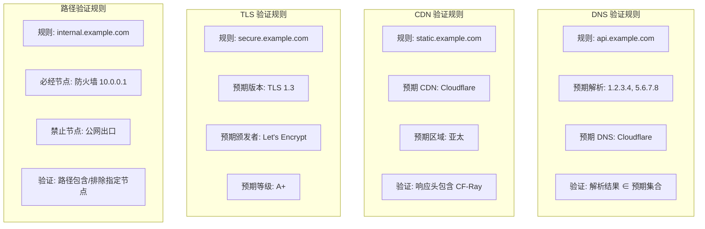

**合规检查项**：

| 检查类型 | 检查项 | 合规标准 | 违规影响 |
|----------|--------|----------|----------|
| DNS 合规 | 解析结果 | 在白名单内 | 可能被劫持 |
| DNS 合规 | 解析时间 | < 100ms | 性能下降 |
| TLS 合规 | 协议版本 | ≥ TLS 1.2 | 安全风险 |
| TLS 合规 | 证书有效期 | > 30 天 | 服务中断风险 |
| TLS 合规 | 安全等级 | ≥ A | 安全风险 |
| 路径合规 | 必经节点 | 包含指定节点 | 安全策略失效 |
| 路径合规 | 禁止节点 | 不包含指定节点 | 数据泄露风险 |

### 2.4 服务可用性探测

服务可用性探测从用户视角验证服务的端到端可达性，弥补设备监控的盲区。

**功能说明**：

| 功能点 | 描述 | 价值 |
|--------|------|------|
| TCP 连通性 | 验证 TCP 端口可达性和连接时间 | 基础连通性保障 |
| TLS 握手 | 验证 TLS 握手成功和耗时 | 安全连接保障 |
| HTTP 可用性 | 验证 HTTP 响应状态和时间 | 应用层可用性 |
| 端到端探测 | 完整链路探测（DNS→TCP→TLS→HTTP） | 全链路可用性 |
| 多点探测 | 从多个地理位置探测 | 全局可用性视图 |

**探测链路**：

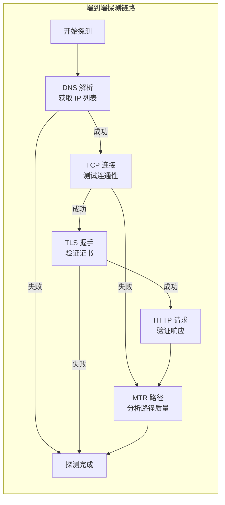

**可用性指标**：

| 探测类型 | 核心指标 | SLA 目标 | 告警阈值 |
|----------|----------|----------|----------|
| DNS | 解析成功率 | 99.99% | < 99.9% |
| DNS | 解析时间 | < 50ms | > 100ms |
| TCP | 连接成功率 | 99.95% | < 99.5% |
| TCP | 连接时间 | < 100ms | > 200ms |
| TLS | 握手成功率 | 99.95% | < 99.5% |
| TLS | 握手时间 | < 200ms | > 500ms |
| HTTP | 请求成功率 | 99.9% | < 99% |
| HTTP | 响应时间 | < 500ms | > 1000ms |
| HTTP | TTFB | < 200ms | > 500ms |

**多点探测架构**：

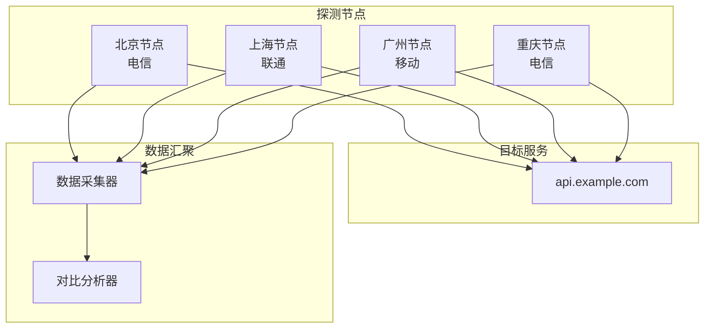

### 2.5 功能全景图

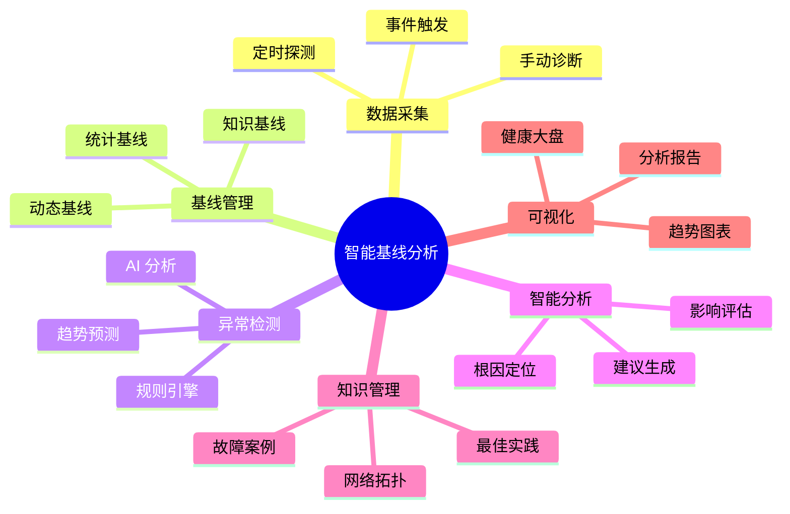

### 2.6 核心功能清单

| 功能模块 | 功能点 | 描述 | 优先级 |
|----------|--------|------|--------|
| 数据采集 | 定时探测 | 按配置周期自动执行网络诊断 | P0 |
| | 手动诊断 | 用户触发的即时诊断 | P0 |
| | 多探测点 | 支持多地域探测节点 | P1 |
| 基线管理 | 自动学习 | 基于历史数据自动建立基线 | P0 |
| | 手动校准 | 支持人工调整基线参数 | P1 |
| | 基线版本 | 基线变更历史追溯 | P2 |
| 异常检测 | 阈值检测 | 基于统计阈值的快速检测 | P0 |
| | 趋势检测 | 检测指标变化趋势 | P1 |
| | 关联检测 | 多指标关联异常检测 | P2 |
| 智能分析 | 根因分析 | LLM 分析异常根本原因 | P0 |
| | 影响评估 | 评估异常对业务的影响 | P1 |
| | 建议生成 | 生成处置建议 | P0 |
| 知识管理 | 知识录入 | 录入运维知识和案例 | P0 |
| | 知识检索 | RAG 检索相关知识 | P0 |
| | 知识更新 | 基于分析结果更新知识 | P2 |

### 2.7 用户场景

**场景 1：日常巡检**

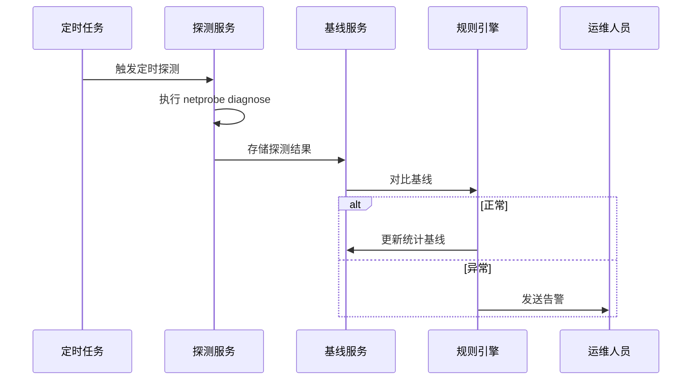

**场景 2：故障诊断**

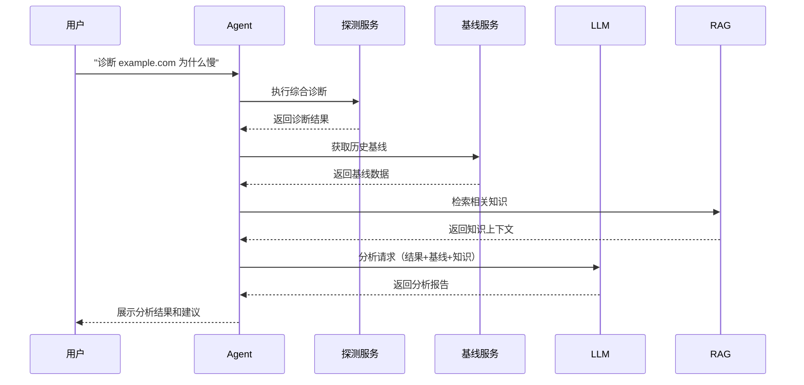

**场景 3：趋势预警**

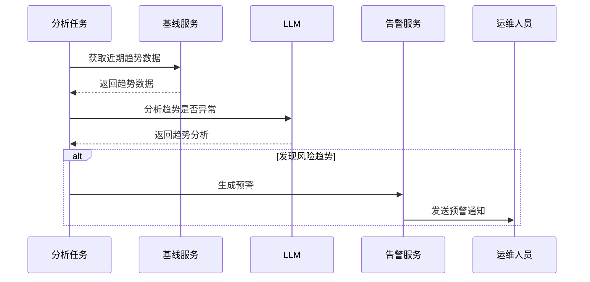

---

## 3. 架构设计

### 3.1 整体架构

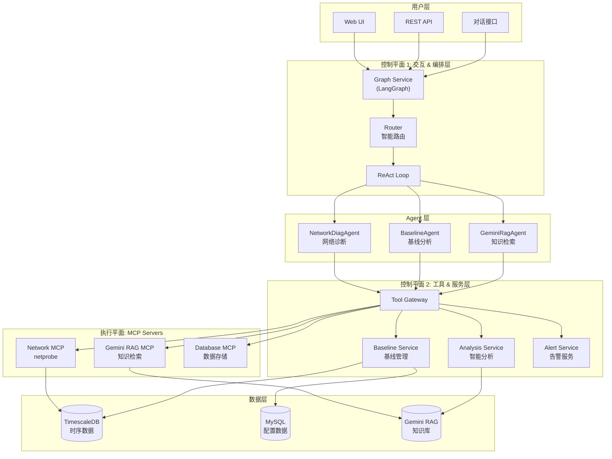

### 3.2 数据流架构

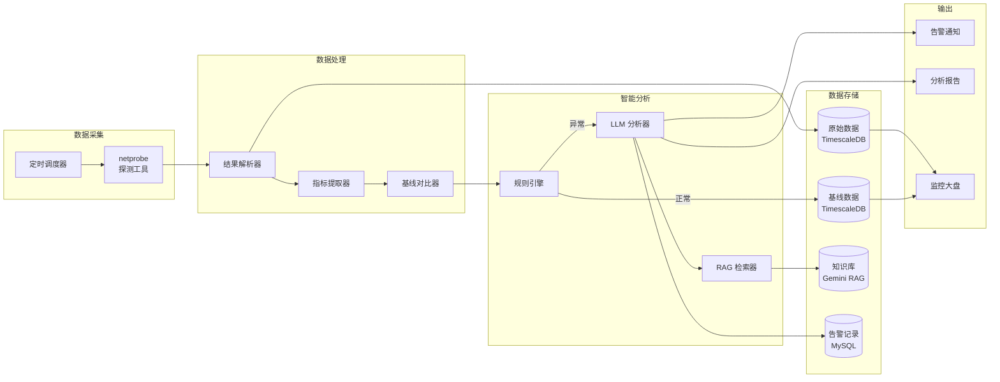

### 3.3 分层架构

| 层级 | 组件 | 职责 | 技术选型 |
|------|------|------|----------|
| 接入层 | Web UI / API | 用户交互入口 | FastAPI |
| 编排层 | Graph Service | Agent 编排和状态管理 | LangGraph |
| Agent 层 | 多 Agent | 领域专家能力 | LangChain |
| 服务层 | 业务服务 | 基线、分析、告警 | Python |
| 执行层 | MCP Servers | 工具执行 | MCP Protocol |
| 探测层 | 分布式探测 Agent | 各区域网络探测 | Go (netprobe) |
| 数据层 | 数据库 | 数据持久化 | TimescaleDB/MySQL |
| 知识层 | RAG | 知识存储和检索 | Gemini RAG |

### 3.4 分布式探测 Agent 架构

探测 Agent 采用分布式部署模式，在各数据中心区域内部署探测节点，实现对内部服务和外部服务的全方位探测。

**部署架构**：

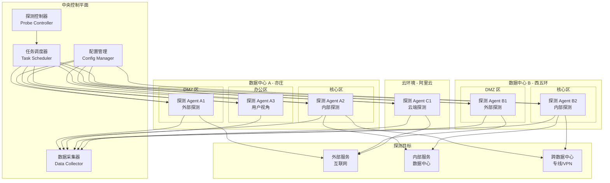

**探测 Agent 类型**：

| Agent 类型 | 部署位置 | 探测方向 | 探测目标 | 典型场景 |
|------------|----------|----------|----------|----------|
| 外部探测 Agent | DMZ 区 | 出站 | 互联网服务、CDN、第三方 API | 验证对外服务可达性 |
| 内部探测 Agent | 核心区 | 内部 | 内部微服务、数据库、中间件 | 验证内部服务健康 |
| 用户视角 Agent | 办公区 | 出站 | 内部应用、外部 SaaS | 模拟用户访问体验 |
| 跨域探测 Agent | 各区域 | 跨域 | 其他数据中心、云环境 | 验证专线/VPN 质量 |
| 云端探测 Agent | 云环境 | 双向 | 云服务、混合云链路 | 验证云端可达性 |

**探测矩阵**：

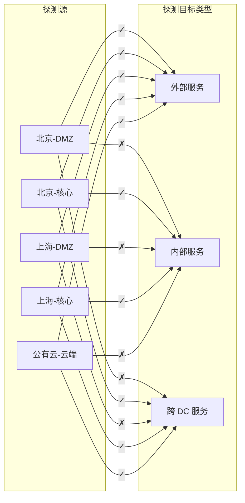

**探测 Agent 通信架构**：

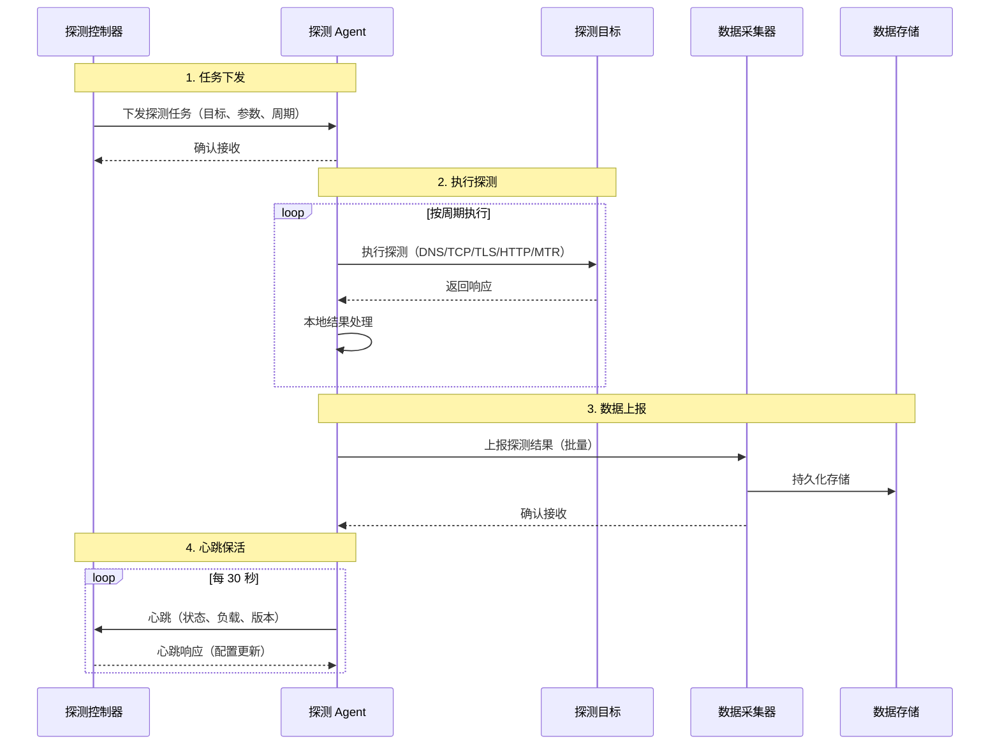

**探测 Agent 配置模型**：

| 配置项 | 说明 | 示例值 |
|--------|------|--------|
| agent_id | Agent 唯一标识 | probe-bj-dmz-01 |
| location | 部署位置 | 北京-DMZ |
| region | 所属区域 | cn-north |
| isp | 网络运营商 | 电信 |
| capabilities | 支持的探测类型 | dns, tcp, tls, http, mtr |
| max_concurrent | 最大并发探测数 | 100 |
| report_interval | 上报间隔（秒） | 60 |
| heartbeat_interval | 心跳间隔（秒） | 30 |

**探测任务分配策略**：

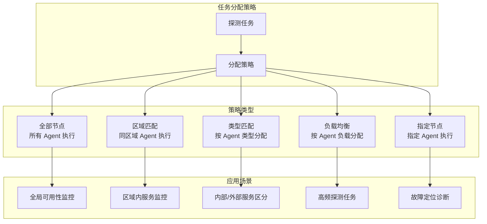

**探测结果聚合分析**：

| 分析维度 | 说明 | 价值 |
|----------|------|------|
| 单点分析 | 单个 Agent 的探测结果分析 | 定位局部问题 |
| 多点对比 | 多个 Agent 对同一目标的结果对比 | 区分网络问题和服务问题 |
| 区域聚合 | 按区域聚合探测结果 | 发现区域性问题 |
| 时序分析 | 同一 Agent 的历史趋势分析 | 发现性能退化 |
| 路径对比 | 不同 Agent 到同一目标的路径对比 | 发现路由差异 |

**多点探测故障定位**：

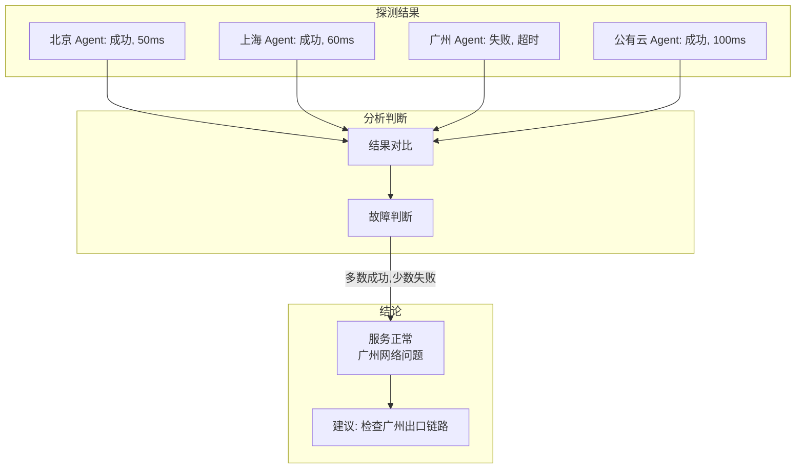

---

## 4. 组件设计

### 4.1 组件清单

| 组件名称 | 类型 | 职责 | 依赖 |
|----------|------|------|------|
| ProbeController | 服务 | 探测 Agent 管理和任务分发 | Redis, MySQL |
| ProbeAgent | 探测节点 | 执行网络探测任务 | netprobe |
| ProbeScheduler | 服务 | 定时调度探测任务 | ProbeController |
| DataCollector | 服务 | 采集和聚合探测结果 | TimescaleDB |
| BaselineService | 服务 | 基线计算和管理 | TimescaleDB |
| RuleEngine | 服务 | 规则匹配和阈值检测 | BaselineService |
| AnalysisService | 服务 | LLM 智能分析 | LLM, RAG |
| AlertService | 服务 | 告警生成和发送 | MySQL |
| BaselineAgent | Agent | 基线分析能力封装 | BaselineService |
| KnowledgeManager | 服务 | 知识库管理 | Gemini RAG |

### 4.2 探测 Agent 组件设计

**ProbeAgent 架构**：

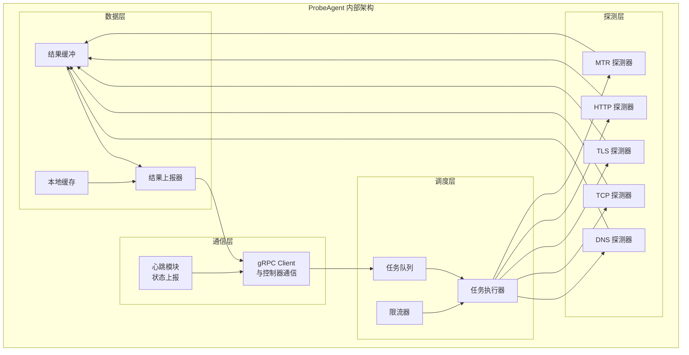

**ProbeController 架构**：

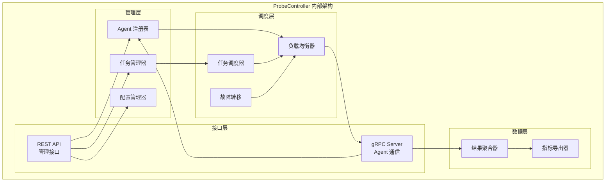

### 4.3 组件交互

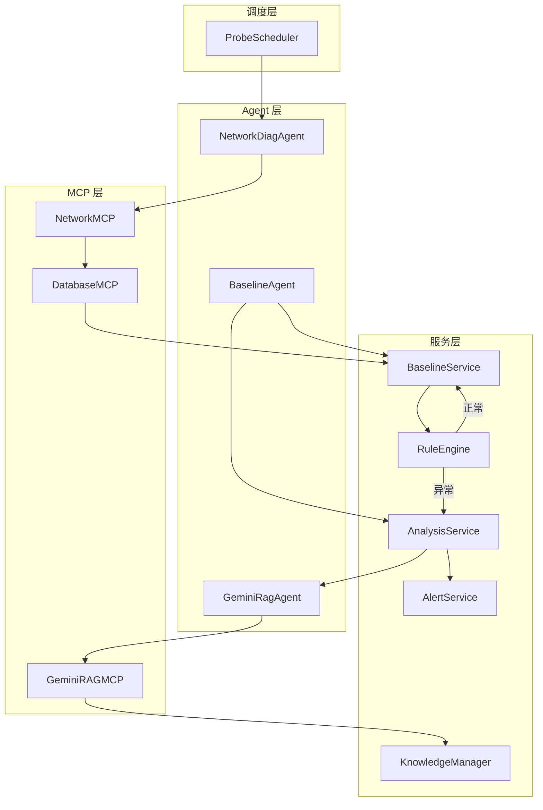

### 4.4 BaselineService 设计

**核心功能**：

| 功能 | 描述 | 输入 | 输出 |
|------|------|------|------|
| 存储探测结果 | 持久化原始探测数据 | UnifiedResult | 存储状态 |
| 计算统计基线 | 基于历史数据计算基线 | 目标、时间范围 | 基线数据 |
| 对比基线 | 当前结果与基线对比 | 当前结果、基线 | 偏差报告 |
| 更新基线 | 增量更新基线数据 | 新数据点 | 更新状态 |
| 查询趋势 | 查询指标历史趋势 | 目标、指标、时间 | 趋势数据 |

**基线计算策略**：

```mermaid
flowchart LR
    subgraph "数据输入"
        Raw["原始数据<br/>7天/30天"]
    end

    subgraph "预处理"
        Filter["异常值过滤<br/>3σ 原则"]
        Group["时间分组<br/>按小时/天"]
    end

    subgraph "统计计算"
        Mean["均值计算"]
        Std["标准差计算"]
        Percentile["百分位计算<br/>P50/P95/P99"]
    end

    subgraph "基线输出"
        Baseline["基线数据<br/>均值±2σ"]
    end

    Raw --> Filter
    Filter --> Group
    Group --> Mean
    Group --> Std
    Group --> Percentile
    Mean --> Baseline
    Std --> Baseline
    Percentile --> Baseline
```

### 4.5 AnalysisService 设计

**分析流程**：

```mermaid
flowchart TB
    Start["开始分析"]
    GetCurrent["获取当前探测结果"]
    GetBaseline["获取历史基线"]
    GetContext["检索 RAG 知识"]
    BuildPrompt["构建分析 Prompt"]
    CallLLM["调用 LLM 分析"]
    ParseResult["解析分析结果"]
    GenerateReport["生成分析报告"]
    End["返回报告"]

    Start --> GetCurrent
    GetCurrent --> GetBaseline
    GetBaseline --> GetContext
    GetContext --> BuildPrompt
    BuildPrompt --> CallLLM
    CallLLM --> ParseResult
    ParseResult --> GenerateReport
    GenerateReport --> End
```

---

## 5. Agent 设计

### 5.1 Agent 全景

| Agent 名称 | 职责 | 工具前缀 | 核心能力 |
|------------|------|----------|----------|
| NetworkDiagAgent | 网络诊断 | network | ping, traceroute, mtr, dns, tcp, tls, http, diagnose |
| BaselineAgent | 基线分析 | baseline | compare, update, query, analyze, trend |
| GeminiRagAgent | 知识检索 | gemini_rag | search, upload, query |
| AlertAgent | 告警管理 | alert | create, query, acknowledge, resolve |

### 5.2 BaselineAgent 详细设计

**Agent 定位**：基线分析专家，负责将探测结果与历史基线对比，识别异常并提供智能分析。

**工具清单**：

| 工具名称 | 功能描述 | 参数 | 返回值 |
|----------|----------|------|--------|
| baseline.compare | 对比当前结果与基线 | target, current_result | 偏差报告 |
| baseline.update | 更新基线数据 | target, data_point | 更新状态 |
| baseline.query | 查询基线数据 | target, metric | 基线值 |
| baseline.trend | 查询趋势数据 | target, metric, time_range | 趋势数据 |
| baseline.analyze | 深度分析异常 | target, anomaly_data | 分析报告 |

**Agent 工作流**：

```mermaid
stateDiagram-v2
    [*] --> ReceiveRequest: 接收分析请求
    ReceiveRequest --> GetCurrentData: 获取当前数据
    GetCurrentData --> GetBaseline: 获取基线
    GetBaseline --> Compare: 对比分析
    Compare --> Normal: 正常
    Compare --> Anomaly: 异常
    Normal --> UpdateBaseline: 更新基线
    UpdateBaseline --> [*]
    Anomaly --> GetContext: 获取上下文
    GetContext --> DeepAnalysis: 深度分析
    DeepAnalysis --> GenerateReport: 生成报告
    GenerateReport --> [*]
```

### 5.3 Agent 协作模式

```mermaid
sequenceDiagram
    participant User
    participant Router
    participant NetworkAgent
    participant BaselineAgent
    participant RAGAgent
    participant LLM

    User->>Router: "诊断 example.com 并分析"
    Router->>NetworkAgent: 路由到网络诊断
    NetworkAgent->>NetworkAgent: 执行 diagnose
    NetworkAgent-->>Router: 返回诊断结果
    Router->>BaselineAgent: 路由到基线分析
    BaselineAgent->>BaselineAgent: 对比基线
    alt 发现异常
        BaselineAgent->>RAGAgent: 请求知识检索
        RAGAgent-->>BaselineAgent: 返回相关知识
        BaselineAgent->>LLM: 请求深度分析
        LLM-->>BaselineAgent: 返回分析结果
    end
    BaselineAgent-->>Router: 返回分析报告
    Router-->>User: 展示综合结果
```

---

## 6. LLM 集成设计

### 6.1 LLM 使用场景

| 场景 | 模型选择 | 调用频率 | 成本等级 |
|------|----------|----------|----------|
| 异常根因分析 | DeepSeek/Gemini | 低（仅异常时） | 中 |
| 趋势预测分析 | DeepSeek | 低（每日一次） | 低 |
| 知识问答 | Gemini | 中（用户触发） | 中 |
| 报告生成 | DeepSeek | 低（按需） | 低 |

### 6.2 LLM 调用流程

```mermaid
flowchart TB
    subgraph "触发条件"
        Anomaly["异常检测触发"]
        UserRequest["用户请求触发"]
        Schedule["定时任务触发"]
    end

    subgraph "预处理"
        Filter["预筛选<br/>规则引擎"]
        Enrich["上下文增强<br/>RAG 检索"]
        Build["Prompt 构建"]
    end

    subgraph "LLM 调用"
        Select["模型选择"]
        Call["API 调用"]
        Parse["结果解析"]
    end

    subgraph "后处理"
        Validate["结果验证"]
        Format["格式化输出"]
        Cache["结果缓存"]
    end

    Anomaly --> Filter
    UserRequest --> Filter
    Schedule --> Filter
    Filter -->|需要 LLM| Enrich
    Filter -->|不需要| Format
    Enrich --> Build
    Build --> Select
    Select --> Call
    Call --> Parse
    Parse --> Validate
    Validate --> Format
    Format --> Cache
```

### 6.3 成本优化策略

| 策略 | 描述 | 预期效果 |
|------|------|----------|
| 规则预筛选 | 简单异常用规则处理 | 减少 80% LLM 调用 |
| 结果缓存 | 相似场景复用分析结果 | 减少 30% 重复调用 |
| 批量处理 | 合并相似异常一起分析 | 减少 50% 调用次数 |
| 模型分级 | 简单任务用便宜模型 | 降低 40% 成本 |
| Prompt 优化 | 精简 Prompt 减少 Token | 降低 20% 成本 |

---

## 7. 提示词设计

### 7.1 异常分析 Prompt

**系统提示词**：

```
你是一位资深的网络运维专家，拥有丰富的网络故障诊断和分析经验。你的任务是分析网络探测结果，识别异常，定位根因，并提供专业的处置建议。

分析原则：
1. 基于数据说话，不做无依据的推测
2. 优先考虑常见原因，再考虑罕见情况
3. 给出可操作的具体建议
4. 评估对业务的影响程度
5. 区分紧急程度，指导处置优先级
```

**用户提示词模板**：

```
请分析以下网络诊断结果：

## 当前探测结果
目标：{target}
探测时间：{timestamp}
探测类型：{probe_type}
探测结果：
{current_result_json}

## 历史基线数据
基线周期：{baseline_period}
基线指标：
{baseline_data}

## 当前偏差
{deviation_summary}

## 相关知识（来自知识库）
{rag_context}

## 最近变更记录
{recent_changes}

请按以下格式输出分析结果：

### 1. 异常判定
- 是否异常：是/否
- 异常类型：[DNS/TCP/TLS/HTTP/网络路径/综合]
- 严重程度：[紧急/重要/一般/提示]

### 2. 异常描述
[简要描述发现的异常现象]

### 3. 根因分析
- 最可能原因：[原因描述]
- 可能性：[高/中/低]
- 其他可能原因：
  1. [原因1]
  2. [原因2]

### 4. 影响评估
- 影响范围：[描述影响的服务/用户]
- 业务影响：[高/中/低]
- 持续时间：[已持续时间或预估]

### 5. 处置建议
- 立即行动：
  1. [具体步骤1]
  2. [具体步骤2]
- 后续跟进：
  1. [跟进事项1]
  2. [跟进事项2]

### 6. 预防措施
[长期改进建议]
```

### 7.2 趋势分析 Prompt

```
请分析以下网络指标的趋势数据：

## 目标信息
目标：{target}
指标：{metric_name}
分析周期：{time_range}

## 趋势数据
{trend_data}

## 基线参考
正常范围：{normal_range}
历史均值：{historical_mean}
历史标准差：{historical_std}

请分析：
1. 当前趋势方向（上升/下降/平稳）
2. 是否存在异常趋势
3. 预测未来 24 小时的走势
4. 是否需要提前预警
5. 建议采取的预防措施
```

### 7.3 知识问答 Prompt

```
你是网络运维知识库助手。请基于以下知识库内容回答用户问题。

## 知识库内容
{rag_retrieved_content}

## 用户问题
{user_question}

## 回答要求
1. 仅基于知识库内容回答，不要编造
2. 如果知识库没有相关内容，明确告知
3. 引用具体的知识来源
4. 给出可操作的建议
```

### 7.4 Prompt 管理

| Prompt 类型 | 存储位置 | 版本管理 | 更新频率 |
|-------------|----------|----------|----------|
| 系统提示词 | config/prompts/ | Git | 低 |
| 用户模板 | config/prompts/ | Git | 中 |
| 动态片段 | 数据库 | 数据库版本 | 高 |

---

## 8. 基线设计

### 8.1 基线类型

| 基线类型 | 描述 | 数据来源 | 更新频率 |
|----------|------|----------|----------|
| 统计基线 | 基于历史数据的统计值 | TimescaleDB | 每日 |
| 知识基线 | 领域知识和最佳实践 | Gemini RAG | 手动 |
| 动态基线 | 考虑时间因素的自适应基线 | 实时计算 | 实时 |
| SLA 基线 | 服务等级协议要求 | 配置文件 | 手动 |

### 8.2 统计基线指标

| 探测类型 | 指标名称 | 基线计算方法 | 异常阈值 |
|----------|----------|--------------|----------|
| DNS | resolution_time_ms | P50, P95, P99 | > P99 × 1.5 |
| DNS | resolved_ips_count | 众数 | 变化 |
| TCP | connect_time_ms | 均值 ± 2σ | > 均值 + 3σ |
| TCP | success_rate | 均值 | < 均值 - 2σ |
| TLS | handshake_time_ms | 均值 ± 2σ | > 均值 + 3σ |
| TLS | cert_days_remaining | 最小值 | < 30 天 |
| TLS | security_grade | 众数 | 降级 |
| HTTP | total_time_ms | P50, P95, P99 | > P99 × 1.5 |
| HTTP | status_code | 众数 | 变化 |
| HTTP | ttfb_ms | P95 | > P95 × 2 |
| MTR | avg_latency_ms | 均值 ± 2σ | > 均值 + 3σ |
| MTR | loss_percent | 最大值 | > 5% |
| MTR | hop_count | 众数 | 变化 > 2 |

### 8.3 基线数据模型

```mermaid
erDiagram
    PROBE_TARGET {
        string target_id PK
        string domain
        int port
        string protocol
        string description
        timestamp created_at
    }

    PROBE_RESULT {
        bigint id PK
        string target_id FK
        timestamp probe_time
        string probe_type
        boolean success
        jsonb result_data
        jsonb extracted_metrics
    }

    BASELINE_CONFIG {
        string config_id PK
        string target_id FK
        string metric_name
        string calculation_method
        int window_days
        float threshold_multiplier
        boolean enabled
    }

    BASELINE_VALUE {
        bigint id PK
        string target_id FK
        string metric_name
        timestamp calculated_at
        float mean_value
        float std_value
        float p50_value
        float p95_value
        float p99_value
        float min_value
        float max_value
        int sample_count
    }

    ANOMALY_RECORD {
        bigint id PK
        string target_id FK
        timestamp detected_at
        string anomaly_type
        string severity
        jsonb current_value
        jsonb baseline_value
        float deviation_percent
        text llm_analysis
        string status
        timestamp resolved_at
    }

    PROBE_TARGET ||--o{ PROBE_RESULT : has
    PROBE_TARGET ||--o{ BASELINE_CONFIG : has
    PROBE_TARGET ||--o{ BASELINE_VALUE : has
    PROBE_TARGET ||--o{ ANOMALY_RECORD : has
```

### 8.4 基线计算流程

```mermaid
flowchart TB
    subgraph "数据准备"
        Query["查询历史数据<br/>默认 7 天"]
        Filter["过滤异常值<br/>3σ 原则"]
        Group["按时间分组<br/>小时/天"]
    end

    subgraph "统计计算"
        CalcMean["计算均值"]
        CalcStd["计算标准差"]
        CalcPercentile["计算百分位数"]
        CalcMinMax["计算最值"]
    end

    subgraph "基线生成"
        Combine["组合基线数据"]
        Validate["验证合理性"]
        Store["存储基线"]
    end

    subgraph "应用"
        Compare["实时对比"]
        Alert["异常告警"]
        Update["增量更新"]
    end

    Query --> Filter
    Filter --> Group
    Group --> CalcMean
    Group --> CalcStd
    Group --> CalcPercentile
    Group --> CalcMinMax
    CalcMean --> Combine
    CalcStd --> Combine
    CalcPercentile --> Combine
    CalcMinMax --> Combine
    Combine --> Validate
    Validate --> Store
    Store --> Compare
    Compare --> Alert
    Compare --> Update
    Update --> Store
```

---

## 9. 监控内容设计

### 9.1 监控目标分类

| 目标类型 | 示例 | 探测方式 | 探测频率 |
|----------|------|----------|----------|
| 核心业务域名 | api.example.com | diagnose (全链路) | 1 分钟 |
| CDN 节点 | cdn.example.com | http + tls | 5 分钟 |
| DNS 服务器 | 8.8.8.8 | nslookup | 1 分钟 |
| 内部服务 | internal.svc | tcp + http | 30 秒 |
| 第三方依赖 | payment.provider.com | http + tls | 5 分钟 |
| 网络路径 | 关键 IP | mtr | 10 分钟 |

### 9.2 监控指标体系

```mermaid
mindmap
  root((监控指标))
    可用性
      成功率
      错误率
      超时率
    性能
      响应时间
      连接时间
      传输时间
    安全
      证书有效期
      TLS 版本
      安全等级
    网络质量
      丢包率
      延迟
      抖动
      跳数
    DNS
      解析时间
      解析结果
      CNAME 链
```

### 9.3 告警规则设计

| 告警名称 | 触发条件 | 严重程度 | 通知方式 |
|----------|----------|----------|----------|
| DNS 解析失败 | success = false | 紧急 | 电话 + 短信 |
| DNS 解析超时 | resolution_time > P99 × 2 | 重要 | 短信 + 邮件 |
| TCP 连接失败 | success = false | 紧急 | 电话 + 短信 |
| TCP 连接慢 | connect_time > baseline + 3σ | 一般 | 邮件 |
| TLS 握手失败 | success = false | 紧急 | 电话 + 短信 |
| 证书即将过期 | days_remaining < 30 | 重要 | 邮件 |
| 证书已过期 | days_remaining < 0 | 紧急 | 电话 + 短信 |
| HTTP 5xx 错误 | status_code >= 500 | 紧急 | 电话 + 短信 |
| HTTP 响应慢 | total_time > P99 × 1.5 | 一般 | 邮件 |
| 高丢包率 | loss_percent > 5% | 重要 | 短信 + 邮件 |
| 路径变化 | hop_count 变化 > 2 | 一般 | 邮件 |

### 9.4 监控大盘设计

```mermaid
flowchart TB
    subgraph "健康概览"
        HealthScore["整体健康分<br/>0-100"]
        StatusCount["状态统计<br/>正常/警告/异常"]
        RecentAlerts["最近告警<br/>Top 5"]
    end

    subgraph "关键指标"
        Availability["可用性<br/>成功率趋势"]
        Latency["延迟<br/>P50/P95/P99"]
        ErrorRate["错误率<br/>按类型分布"]
    end

    subgraph "目标详情"
        TargetList["目标列表<br/>状态/指标"]
        TargetDetail["目标详情<br/>历史趋势"]
        TargetCompare["目标对比<br/>多目标对比"]
    end

    subgraph "分析报告"
        AnomalyList["异常列表<br/>待处理"]
        AnalysisReport["分析报告<br/>LLM 生成"]
        TrendReport["趋势报告<br/>周/月"]
    end
```

---

## 10. RAG 知识库设计

### 10.1 知识分类

| 知识类型 | 描述 | 来源 | 更新方式 |
|----------|------|------|----------|
| 目标基线 | 各目标的正常行为描述 | 自动生成 | 自动 |
| 故障案例 | 历史故障和解决方案 | 人工录入 | 手动 |
| 最佳实践 | 网络运维最佳实践 | 文档导入 | 手动 |
| 网络拓扑 | 网络架构和依赖关系 | 人工维护 | 手动 |
| SLA 定义 | 服务等级协议 | 配置导入 | 手动 |
| 变更记录 | 网络变更历史 | 系统集成 | 自动 |

### 10.2 知识文档结构

**目标基线文档**：

```yaml
document_type: target_baseline
target: api.example.com
port: 443
protocol: https
last_updated: 2025-12-30

normal_behavior:
  dns:
    resolution_time_ms: 10-30
    expected_ips: ["1.2.3.4", "5.6.7.8"]
    dns_provider: "Cloudflare"
  tcp:
    connect_time_ms: 20-50
    success_rate: 99.9%
  tls:
    handshake_time_ms: 50-100
    certificate_issuer: "Let's Encrypt"
    renewal_cycle: "90 days"
    expected_grade: "A"
  http:
    response_time_ms: 100-300
    expected_status: 200
    server: "nginx"

dependencies:
  - cdn.example.com
  - db.internal.svc
  - redis.internal.svc

sla:
  availability: 99.95%
  response_time_p99: 500ms

contacts:
  owner: "platform-team"
  oncall: "sre-oncall"
```

**故障案例文档**：

```yaml
document_type: incident_case
incident_id: INC-2025-001
date: 2025-01-15
duration: 45 minutes
severity: P1

symptoms:
  - "api.example.com HTTP 响应时间从 200ms 上升到 2000ms"
  - "TCP 连接时间正常"
  - "TLS 握手时间正常"

root_cause: "后端数据库连接池耗尽"

diagnosis_steps:
  1. "检查 HTTP 响应时间 - 异常"
  2. "检查 TCP/TLS 时间 - 正常"
  3. "排除网络问题，定位到应用层"
  4. "检查后端服务日志"
  5. "发现数据库连接超时"

resolution:
  immediate: "重启应用服务，释放连接"
  permanent: "增加连接池大小，添加连接超时配置"

lessons_learned:
  - "添加数据库连接池监控"
  - "设置连接池告警阈值"

related_targets:
  - api.example.com
  - db.internal.svc
```

### 10.3 RAG 检索策略

```mermaid
flowchart TB
    subgraph "查询处理"
        Query["用户查询/异常数据"]
        Extract["提取关键信息<br/>目标/指标/症状"]
        Expand["查询扩展<br/>同义词/相关词"]
    end

    subgraph "检索执行"
        Vector["向量检索<br/>语义相似"]
        Keyword["关键词检索<br/>精确匹配"]
        Filter["元数据过滤<br/>目标/类型"]
    end

    subgraph "结果处理"
        Merge["结果合并"]
        Rank["相关性排序"]
        Truncate["截断<br/>Top K"]
    end

    subgraph "输出"
        Context["上下文组装"]
        Return["返回结果"]
    end

    Query --> Extract
    Extract --> Expand
    Expand --> Vector
    Expand --> Keyword
    Vector --> Filter
    Keyword --> Filter
    Filter --> Merge
    Merge --> Rank
    Rank --> Truncate
    Truncate --> Context
    Context --> Return
```

### 10.4 知识更新机制

| 更新类型 | 触发条件 | 更新内容 | 审核要求 |
|----------|----------|----------|----------|
| 自动更新 | 基线重新计算 | 目标基线文档 | 无 |
| 半自动更新 | 异常分析完成 | 故障案例（草稿） | 人工审核 |
| 手动更新 | 运维人员操作 | 任意文档 | 无 |
| 批量导入 | 管理员操作 | 最佳实践/拓扑 | 人工审核 |

---

## 11. 技术栈

### 11.1 技术选型原则

本方案采用全开源技术栈，无商业软件许可费用。基础设施成本（约 ¥200/月）仅为云服务器托管费用。

| 原则 | 说明 |
|------|------|
| 全开源 | 所有软件组件均为开源，无许可费用 |
| 成熟稳定 | 选择经过生产验证的成熟方案 |
| 社区活跃 | 优先选择社区活跃、文档完善的项目 |
| 易于运维 | 降低运维复杂度，减少人力成本 |

### 11.2 技术选型

| 层级 | 组件 | 技术选型 | 许可证 | 选型理由 |
|------|------|----------|--------|----------|
| 语言 | 后端 | Python 3.11+ | PSF | 生态丰富，AI 支持好 |
| | 探测工具 | Go | BSD | 高性能，跨平台 |
| 框架 | Web | FastAPI | MIT | 异步，高性能，文档自动生成 |
| | Agent | LangGraph + LangChain | MIT | 成熟的 Agent 框架 |
| 数据库 | 时序数据 | TimescaleDB | Apache 2.0 | PostgreSQL 兼容，时序优化 |
| | 关系数据 | MySQL 8.0 | GPL | 成熟稳定 |
| | 缓存 | Redis | BSD | 高性能缓存 |
| LLM | 主模型 | DeepSeek | 按量付费 | 性价比高，中文好 |
| | 备选模型 | Gemini | 按量付费 | 多模态，RAG 集成 |
| RAG | 知识库 | Gemini RAG | 按量付费 | 原生集成，易用 |
| 消息队列 | 异步任务 | Redis Queue | BSD | 轻量，与缓存复用 |
| 监控 | 指标 | Prometheus | Apache 2.0 | 标准方案 |
| | 日志 | Loguru | MIT | Python 日志库 |
| 部署 | 容器 | Docker | Apache 2.0 | 标准化部署 |
| | 编排 | Docker Compose | Apache 2.0 | 简单场景 |

### 

### 11.3 技术架构图

```mermaid
flowchart TB
    subgraph "前端"
        WebUI["Web UI<br/>React/Vue"]
    end

    subgraph "API 网关"
        FastAPI["FastAPI<br/>REST API"]
    end

    subgraph "应用层"
        GraphService["Graph Service<br/>LangGraph"]
        Agents["Agents<br/>LangChain"]
        Services["Business Services<br/>Python"]
    end

    subgraph "MCP 层"
        NetworkMCP["Network MCP<br/>Python + Go"]
        RAGMCP["RAG MCP<br/>Python"]
        DBMCP["DB MCP<br/>Python"]
    end

    subgraph "数据层"
        TimescaleDB[("TimescaleDB<br/>时序数据")]
        MySQL[("MySQL<br/>配置数据")]
        Redis[("Redis<br/>缓存")]
    end

    subgraph "外部服务"
        DeepSeek["DeepSeek API"]
        GeminiRAG["Gemini RAG API"]
    end

    WebUI --> FastAPI
    FastAPI --> GraphService
    GraphService --> Agents
    Agents --> Services
    Services --> NetworkMCP
    Services --> RAGMCP
    Services --> DBMCP
    NetworkMCP --> TimescaleDB
    DBMCP --> MySQL
    Services --> Redis
    Agents --> DeepSeek
    RAGMCP --> GeminiRAG
```

### 11.4 依赖清单

| 类别 | 依赖 | 版本 | 用途 |
|------|------|------|------|
| 核心框架 | fastapi | 0.109+ | Web 框架 |
| | uvicorn | 0.27+ | ASGI 服务器 |
| | langgraph | 0.0.30+ | Agent 编排 |
| | langchain | 0.1.0+ | Agent 框架 |
| 数据库 | psycopg2 | 2.9+ | PostgreSQL 驱动 |
| | sqlalchemy | 2.0+ | ORM |
| | redis | 5.0+ | Redis 客户端 |
| LLM | openai | 1.0+ | LLM API 客户端 |
| | google-generativeai | 0.3+ | Gemini API |
| 工具 | pydantic | 2.0+ | 数据验证 |
| | loguru | 0.7+ | 日志 |
| | httpx | 0.26+ | HTTP 客户端 |

---

## 12. 价值体现

### 12.1 业务价值

| 价值维度 | 当前状态 | 目标状态 | 量化收益 |
|----------|----------|----------|----------|
| 故障发现 | 用户报障后发现 | 主动发现 | MTTD 从 30 分钟降至 5 分钟 |
| 故障定位 | 人工排查 1-2 小时 | AI 辅助 10 分钟 | MTTR 降低 80% |
| 告警质量 | 大量无效告警 | 精准告警 | 告警准确率从 60% 提升至 95% |
| 知识传承 | 依赖专家经验 | 知识库沉淀 | 新人上手时间从 3 月降至 1 月 |
| 预防能力 | 无 | 趋势预警 | 预防 50% 的可预见故障 |

### 12.2 技术价值

| 价值维度 | 描述 |
|----------|------|
| 数据资产 | 积累结构化的网络诊断数据，支持数据分析和机器学习 |
| 知识资产 | 建立可复用的运维知识库，降低对个人经验的依赖 |
| 能力沉淀 | 将专家经验转化为可执行的规则和模型 |
| 架构演进 | 为 AIOps 平台建设奠定基础 |
| 标准化 | 统一诊断流程和输出格式，便于集成和扩展 |

### 12.3 风险与应对

| 风险 | 可能性 | 影响 | 应对措施 |
|------|--------|------|----------|
| LLM 分析准确率不达标 | 中 | 高 | 持续优化 Prompt，增加人工审核 |
| LLM 成本超预算 | 中 | 中 | 实施成本优化策略，设置调用限制 |
| 基线学习周期长 | 低 | 中 | 支持手动配置初始基线 |
| 知识库冷启动 | 高 | 中 | 预置通用知识，逐步积累 |
| 系统性能瓶颈 | 低 | 高 | 提前进行性能测试和优化 |

---

## 附录

### A. 术语表

| 术语 | 定义 |
|------|------|
| 基线 (Baseline) | 系统正常运行时的指标参考值 |
| MTTD | Mean Time To Detect，平均故障发现时间 |
| MTTR | Mean Time To Recover，平均故障恢复时间 |
| RAG | Retrieval-Augmented Generation，检索增强生成 |
| AIOps | AI for IT Operations，智能运维 |
| SLA | Service Level Agreement，服务等级协议 |

### B. 参考资料

| 资料 | 链接 |
|------|------|
| LangGraph 文档 | https://langchain-ai.github.io/langgraph/ |
| TimescaleDB 文档 | https://docs.timescale.com/ |
| Gemini API 文档 | https://ai.google.dev/docs |
| DeepSeek API 文档 | https://platform.deepseek.com/docs |

### C. 变更记录

| 版本 | 日期 | 变更内容 | 作者 |
|------|------|----------|------|
| v1.0 | 2025-12-30 | 初始版本 | AI Agent |
| v1.1 | 2025-12-30 | 补充方案定位说明、三大核心功能详细描述、技术栈成本说明 | AI Agent |
| v1.2 | 2025-12-30 | 补充分布式探测 Agent 架构设计、探测 Agent 组件设计 | AI Agent |
